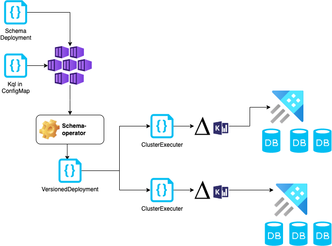

# Azure-Schema-Operator

[](https://goreportcard.com/report/github.com/Microsoft/azure-schema-operator)


> Note: The API is expected to change (while adhering to semantic versioning). Alpha and Beta resources are generally not recommended for production environments. Alpha, Beta, and Stable mean roughly the same for this project as they do for [all Kubernetes features](https://kubernetes.io/docs/reference/command-line-tools-reference/feature-gates/#feature-stages).

Azure Schema Operator project is aimed to manage a schema changes of varios Azure Resources (e.g. Azure SQL, Azure Data Explorer, Azure EventsHub) using declarative approach via Kubernetes resources.

A developer defines the schema in source location (e.g. configMap) and the
operator will make sure to apply it on all the defined clusters.



The Operator offloads the heavy lifting to schema tools such as [delta-kusto](https://github.com/microsoft/delta-kusto)
and instead focuses on ensuring the validity of the deployment process.  
The operator will validate that the schema was deployed on all databases on all clusters or rollback to a previous successful version.

Currently supports:

- Azure Data Explorer (Kusto)
- SQL Server
- Eventhubs (Schema-Registry)

Soon To Be supported:

- Cosmos

## Status

The project is currently in Alpha status, you can follow status and project plans in the open [tasks page](/docs/Tasks.md)

## Usage

Follow the [installation guide](/docs/Install.md) to deploy the operator.  
The schema operator expects a configMap with the kql data (generated by `delta-kusto` on the dev environment)

```yaml
apiVersion: v1
kind: ConfigMap
metadata:
  name: dev-template-kql
  namespace: default
data:
  kql: |
    .create-or-alter function  Add(a:real,b:real) {a+b}
```

In this simple example we have a configMap that defines a single function.
Now we create the `SchemaDeployment` object (our schema object to apply on all clusters)

```yaml
apiVersion: dbschema.microsoft.com/v1alpha1
kind: SchemaDeployment
metadata:
  name: master-test-template
spec:
  type: kusto
  applyTo:
    clusterUris: ['https://sampleadx.westeurope.kusto.windows.net']
    db: 'tenant_'
  failIfDataLoss: false
  failurePolicy: rollback
  source:
    name: dev-template-kql
    namespace: default
```

The template defines the cluster list (`sampleadx`) and a regular expression
 to filter databases by thier name (`tenant_` is our sample filter but can be any regexp)

## Authentication

the `schema-operator` needs access and perimssions on the target databases.
Authorisation can be defined either by `MSI` (recommanded) or by defining a secret.

To use `MSI`, `AZURE_USE_MSI` environemt variable needs to be defined on the manager pod.

To use a secret, we need to define a secret with the relevant credentials:

```yaml
apiVersion: v1
kind: Secret
metadata:
  name: schemaoperator
  namespace: schema-operator-system
type: Opaque
data:
  AZURE_SUBSCRIPTION_ID: <base64 encoding of the subscription>
  AZURE_TENANT_ID: <base64 encoding of the tenant id>
  AZURE_CLIENT_ID: <base64 encoding of the client id>
  AZURE_CLIENT_SECRET: <base64 encoding of the client secret>

```

and later define these as env entries:

```yaml
env:
  - name: AZURE_USE_MSI
    value: 'false'
  - name: SCHEMAOP_CLIENT_ID
    valueFrom:
      secretKeyRef:
        key: AZURE_CLIENT_ID
        name: schemaoperator
        optional: true
  - name: SCHEMAOP_CLIENT_SECRET
    valueFrom:
      secretKeyRef:
        key: AZURE_CLIENT_SECRET
        name: schemaoperator
        optional: true
  - name: SCHEMAOP_TENANT_ID
    valueFrom:
      secretKeyRef:
        key: AZURE_TENANT_ID
        name: schemaoperator
        optional: true
```

### Prerequisites

The schema operator is written in [GO](https://go.dev).
To develop the project you need to following:

- Go
- operator-sdk
- Docker
- sqlpackge
- delta-kusto

## Running the tests

The project uses [Ginkgo](https://github.com/onsi/ginkgo) with [envtest](https://pkg.go.dev/sigs.k8s.io/controller-runtime@v0.11.0/pkg/envtest)
To run the tests locally simple run:

```bash
make test
```

| :exclamation:  Mac M1 users (arm64) should run under rosetta or in the dev container, envtest does not support darwin/arm64. |
|------------------------------------------------------------------------------------------------------------------------------|

## Built With

The project is build using the [Operator SDK](https://github.com/operator-framework/operator-sdk)

## Contributing

Please read our [CONTRIBUTING.md](CONTRIBUTING.md) which outlines all of our policies, procedures, and requirements for contributing to this project.
As well as the [contribution docs](https://github.com/Microsoft/azure-schema-operator/contributing) on development and testing.

## Versioning and changelog

We use [SemVer](http://semver.org/) for versioning. For the versions available, see the [releases on this repository](https://github.com/microsoft/azure-schema-operator/releases).

## Authors

- Jony Vesterman Cohen
- Dmitry Meytin

## License

This project is licensed under the MIT License - see the [LICENSE](LICENSE) file for details

## Acknowledgments

- [Delta-Kusto](https://github.com/microsoft/delta-kusto) for the cooperation when we developed this operator.
- [Azure-service-operator](https://github.com/Azure/azure-service-operator) for a source on how to write a good operator.  
- [operator-sdk](https://sdk.operatorframework.io) for fast development process.  
